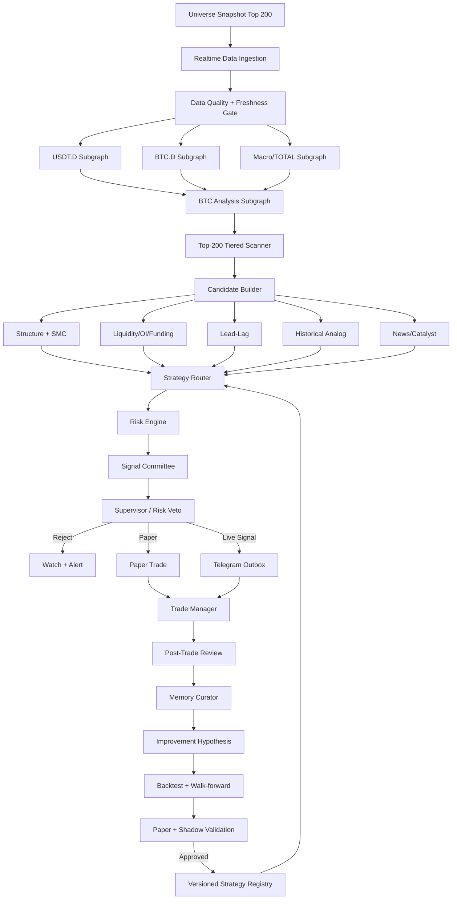

# AuraLiam369 Trading Intelligence OS
## معماری اجرایی، ورک‌فلو و پرامپت مادر برای پنل چندایجنتی ترید

**نسخه:** 2.1  
**تاریخ:** 2026-08-13  
**وضعیت:** مشخصات مرجع پیاده‌سازی  
**زبان اصلی اجرا:** Python 3.12+  

---

# 1) تعریف دقیق سیستم

این پروژه نباید یک «چت‌بات که گاهی تحلیل می‌کند» باشد. باید یک **سیستم‌عامل هوشمند ترید رویدادمحور** باشد که چهار بخش مستقل ولی هماهنگ دارد:

1. **انجین‌های قطعی محاسباتی** برای قیمت، حجم، کندل، اندیکاتورها، ساختار بازار، FVG، Order Block، لیکوییدیتی، بک‌تست و مدیریت ریسک.
2. **ایجنت‌های تخصصی استدلالی** برای تحقیق، تفسیر، مقایسه‌ی گذشته، تحلیل خبر، بررسی اختلاف‌ها و ارائه‌ی پیشنهاد.
3. **لایه‌ی حافظه و یادگیری کنترل‌شده** برای ذخیره‌ی سوابق هر ارز، هر ستاپ، هر سیگنال و علت نتیجه.
4. **لایه‌ی حاکمیت، نظارت و کنترل کیفیت** که اجازه نمی‌دهد داده‌ی ناقص، تحلیل تکراری، خروجی متناقض یا تغییر آزمایش‌نشده وارد سیگنال نهایی شود.

اصل بنیادین:

> محاسبات لحظه‌ای بازار با کد قطعی انجام می‌شود؛ LLM روی هر تیک قیمت فراخوانی نمی‌شود. ایجنت فقط زمانی فعال می‌شود که رویداد مهم، اختلاف تحلیلی، نیاز تحقیقاتی، فرصت معاملاتی یا چرخه‌ی یادگیری ایجاد شده باشد.

حالت‌های رسمی سیستم:

- `BACKTEST`
- `HISTORICAL_REPLAY`
- `PAPER`
- `SHADOW_LIVE`؛ سیگنال زنده بدون ارسال به کاربر
- `LIVE_SIGNAL`؛ ارسال سیگنال، بدون اجرای خودکار معامله
- `LIVE_EXECUTION` فقط در صورت فعال‌سازی جداگانه، احراز هویت امن، کنترل انسانی و تست کامل؛ در نسخه‌ی پایه خاموش باشد.

---

# 2) قوانین غیرقابل‌مذاکره

1. **هیچ سیگنالی با داده‌ی ناقص، قدیمی یا نامشخص صادر نشود.** مقدار `UNKNOWN` در هر مرحله‌ی اجباری به معنی رد سیگنال است.
2. **هر داده باید Source Lineage داشته باشد:** منبع، زمان رویداد، زمان دریافت، نسخه‌ی تبدیل و شناسه‌ی Snapshot.
3. **منابع مختلف بی‌صدا با هم مخلوط نشوند.** برای هر متریک یک منبع اصلی و یک منبع پشتیبان تعریف شود. تغییر منبع باید ثبت و در خروجی اعلام شود.
4. **هیچ دو ایجنت یا Workflow روی یک فایل JSON مشترک ننویسند.** فایل‌هایی مانند state، log یا paper state نباید محل نوشتن هم‌زمان چند Workflow باشند.
5. وضعیت مشترک فقط از طریق Database، Event Bus، تراکنش، Idempotency Key و Lock مدیریت شود.
6. داده‌های تولیدی Runtime داخل Git commit نشوند.
7. GitHub Actions برای CI/CD، تست، بک‌فیل یا کارهای زمان‌بندی‌شده‌ی محدود باشد؛ نه برای Loop لحظه‌ای بازار.
8. هر ایجنت حافظه‌ی جداگانه دارد. فقط **Memory Curator** اجازه دارد یک آموخته را به حافظه‌ی مشترک تأییدشده ارتقا دهد.
9. هیچ ایجنتی حق ندارد بر اساس یک یا دو نتیجه، منطق Strategy زنده را مستقیم تغییر دهد.
10. هر تغییر Strategy از مسیر `Hypothesis → Backtest → Walk-forward → Paper → Shadow → Review → Promotion` عبور کند.
11. خطوط، سطوح، FVG و OB حذف فیزیکی نشوند؛ فقط وضعیت Lifecycle آن‌ها عوض شود: `ACTIVE`, `BROKEN`, `FLIPPED`, `MITIGATED`, `INVALIDATED`, `HISTORICAL`.
12. خلاف روند معامله نشود، مگر Strategy مشخصاً Counter-trend باشد و شروط نقض روند و مجوز آن Strategy کامل شده باشد.
13. خروجی واقعی و Paper هیچ‌وقت با هم ترکیب نشوند. آمار، Equity، Win Rate و Memory آن‌ها Namespace جدا داشته باشند.
14. هیچ تصمیمی فقط بر اساس Sentiment، خبر، یک اندیکاتور یا یک ایجنت صادر نشود.
15. هر سیگنال باید Snapshot کامل قبل از ورود داشته باشد تا Postmortem واقعی ممکن باشد.
16. هیچ Agent نباید خروجی Agent دیگر را به‌عنوان «واقعیت» بپذیرد؛ فقط `Evidence Packet` استاندارد قابل استناد است.
17. در صورت اختلاف شدید بین USDT.D، BTC، ساختار ارز و لیکوییدیتی، نتیجه `NO_TRADE` باشد.
18. سیستم باید دلیل رد هر فرصت را هم ذخیره کند، نه فقط دلیل صدور سیگنال را.
19. هیچ کلید API، Secret، Token یا Credential داخل کد، لاگ، Prompt، Git یا پنل نمایش داده نشود.
20. ارسال تلگرام باید یک سرویس یکتا با Outbox و Deduplication باشد تا هیچ سیگنال دوبار ارسال نشود.

---

# 3) تفکیک «انجین» و «ایجنت»

## انجین

انجین یک ماژول قطعی است که با ورودی یکسان، خروجی یکسان می‌دهد. نمونه‌ها:

- محاسبه‌ی RSI/MACD/MFI/IBS
- تشخیص Pivot و Trendline
- تشخیص BOS/CHoCH/FVG/OB
- محاسبه‌ی Volume Spike، OI، Funding و Liquidation
- بک‌تست، Replay و محاسبه‌ی MFE/MAE
- Position Sizing و Risk Limits

## ایجنت

ایجنت روی خروجی انجین‌ها کار می‌کند و مسئول این موارد است:

- تحقیق و جمع‌بندی
- مقایسه‌ی تاریخی
- تفسیر اختلاف داده‌ها
- پیشنهاد فرضیه
- بررسی خبر و Catalyst
- مرور حافظه
- توضیح علت تصمیم
- پیشنهاد ارتقای سیستم

هر انجین می‌تواند ایجنت همراه داشته باشد، اما ایجنت حق ندارد محاسبه‌ی عددی انجین را با حدس خود جایگزین کند.

---

# 4) معماری فنی پیشنهادی

## هسته‌ی اجرا

- **Python 3.12+** برای تمام انجین‌های بازار، بک‌تست و سرویس‌ها
- **FastAPI** برای API داخلی و پنل
- **LangGraph** برای Orchestration، State، Subgraph، Checkpoint و Handoff بین ایجنت‌ها
- **n8n** فقط برای Integration، اعلان، Telegram، Calendar، Webhook، گزارش و کارهای زمان‌بندی‌شده؛ نه برای پردازش تیک بازار
- **NATS JetStream** برای Event Bus و Queue رویدادهای بازار
- **PostgreSQL + TimescaleDB** برای کندل، Feature، سیگنال، معامله و وضعیت عملیاتی
- **ClickHouse** برای Event Study، Lead-Lag، بک‌تست وسیع و Queryهای سنگین تاریخی
- **Redis** برای Hot State، Cache، Distributed Lock، Cooldown و Deduplication
- **MinIO/S3 + Parquet** برای ذخیره‌ی Raw Market Data و Snapshotهای تغییرناپذیر
- **pgvector یا Qdrant** برای جست‌وجوی شباهت در حافظه‌ی تحلیلی؛ فقط برای متن و بردار، نه جایگزین دیتابیس عددی
- **Prometheus + Grafana + OpenTelemetry** برای Metrics، Trace، Latency، Error و Health
- **Docker Compose** برای شروع؛ در مقیاس بالاتر Kubernetes اختیاری

## قانون انتخاب ابزار

- LangGraph = تصمیم‌گیری، جریان بین ایجنت‌ها، حافظه‌ی اجرایی و Resume
- n8n = اتصال به Telegram، Webhook، Calendar، Email و گزارش
- Event Bus = حمل رویدادهای بازار
- Database = حقیقت مشترک
- LLM = تحلیل و تفسیر، نه Price Feed و Indicator Loop

اگر از Graphify استفاده شود، فقط برای نقشه‌ی کدبیس و کاهش خواندن تکراری فایل‌ها توسط Coding Agent باشد؛ جایگزین LangGraph، Event Bus یا Runtime Trading Orchestrator نیست.

---

# 5) معماری داده و پایش 200 ارز

## Universe روزانه

هر روز یک Snapshot مستقل از Universe ساخته شود:

1. 200 ارز برتر بر اساس Market Cap و نقدشوندگی
2. فقط جفت‌هایی که در Bitunix یا صرافی هدف قابل معامله‌اند
3. حذف Stablecoinها، Wrappedهای تکراری و دارایی‌های فاقد حجم کافی، مگر برای تحلیل Macro لازم باشند
4. ذخیره‌ی کامل اعضای Universe همان روز برای جلوگیری از Survivorship Bias
5. ثبت Listing، Delisting، تغییر Symbol و Contract Address

## پایش سه‌سطحی

### Tier 0 — تمام 200 نماد، دائمی

- Ticker
- Mark Price
- 1m Kline
- 24h Volume
- Spread تقریبی
- Funding در صورت دسترسی
- بازده 1m/5m/15m/1h/4h/24h
- Volume Ratio و Volatility

### Tier 1 — حدود 40 تا 60 نماد منتخب پویا

شرایط ارتقا به Tier 1:

- نزدیک‌شدن به سطح مهم
- Volume Spike
- حرکت غیرعادی
- Lead-Lag Candidate
- News/Catalyst
- Strategy Proximity

داده‌های اضافه:

- Trade Stream
- Order Book سبک
- OI/Funding دقیق‌تر
- ساختار 15m/5m
- FVG/OB فعال

### Tier 2 — حدود 10 تا 20 نماد نزدیک به ورود

- Order Book عمیق‌تر
- Liquidity Map/Heatmap
- Liquidation/OI Delta
- تحلیل کامل 4H/1H/15m/5m
- Historical Analog
- Strategy Validation
- Risk Simulation
- News Verification

این طراحی اجازه می‌دهد 200 ارز دائماً پایش شوند، اما منابع سنگین فقط روی ارزهای واقعاً مهم مصرف شوند.

---

# 6) Registry انجین‌ها و ایجنت‌ها

| ID | انجین / ایجنت | وظیفه‌ی اصلی | خروجی اجباری |
|---|---|---|---|
| E00 | Master Orchestrator / Chief Trader | ساخت DAG هر تحلیل، ارجاع وظایف، جمع‌بندی نهایی | `DecisionCase` |
| E01 | Universe Engine / Universe Agent | ساخت Top-200 روزانه، تطبیق با Bitunix، Liquidity Filter | `UniverseSnapshot` |
| E02 | Market Data Engine / Data Quality Agent | WebSocket، Backfill، Gap Detection، Timestamp، Source Consistency | `DataHealthPacket` |
| E03 | USDT.D Engine / USDT Dominance Agent | تحلیل مستقل 4H/1H/15m، خطوط، S/R، FVG/OB، Regime | `DominancePacket` |
| E04 | BTC.D Engine / BTC Dominance Agent | تحلیل مستقل تخصیص سرمایه BTC در برابر Altها | `DominancePacket` |
| E05 | Macro Regime Engine / Macro Agent | TOTAL/TOTAL2/TOTAL3/OTHERS/ETH.D، DXY و رویدادهای کلان در صورت دسترسی | `MacroRegimePacket` |
| E06 | BTC Analysis Engine / BTC Agent | تحلیل کامل BTC، اندیکاتورها، فیبو، لیکوییدیتی و Pullback Plus | `BTCContextPacket` |
| E07 | Structure Engine / Structure Agent | Pivot، Trendline، Channel، S/R، BOS/CHoCH چندتایم‌فریم | `StructurePacket` |
| E08 | SMC Engine / SMC Agent | FVG، OB، Mitigation، Liquidity Sweep، Inducement | `SMCPacket` |
| E09 | Indicator Engine / Indicator Agent | RSI، MACD، MFI، IBS، ADX، ATR، VWAP و Divergence | `IndicatorPacket` |
| E10 | Liquidity & Derivatives Engine / Liquidity Agent | Order Book، Heatmap، Liquidation، OI، Funding و Stop Hunt | `LiquidityPacket` |
| E11 | Strategy Router / Strategy Agents | اجرای S1، S2، Liam S، Pullback Plus و ONE-IDM Wick 15 | `StrategyMatch[]` |
| E12 | Lead-Lag Engine / Relationship Agent | کشف رابطه‌ی پیشرو-پیرو، Event Study و Follow-on Pump | `LeadLagPacket` |
| E13 | Historical Analog Engine / Analog Agent | یافتن شرایط گذشته‌ی مشابه با Regime و Featureهای فعلی | `AnalogPacket` |
| E14 | News & Catalyst Engine / Research Agent | Ainvest، CMC، CoinGecko، Crypto Bubbles، X، Listing و Launch Calendar | `CatalystPacket` |
| E15 | Watch & Alert Engine / Watch Agent | علامت‌گذاری سطح، Proximity، Alert و Re-analysis Trigger | `WatchCase` |
| E16 | Risk Engine / Risk Officer | Entry، SL، TP، RR، Exposure، Correlation Cluster و Portfolio Heat | `RiskPacket` |
| E17 | Signal Committee / Decision Agent | Hard Gate، Conflict Resolution و Confidence Calibration | `SignalDecision` |
| E18 | Paper/Replay/Backtest Engine / Experiment Agent | بک‌تست، Walk-forward، Replay و Paper | `ExperimentResult` |
| E19 | Trade Management Engine / Trade Manager Agent | مدیریت پوزیشن، Trailing، Partial، Invalidation و Exit | `TradeState` |
| E20 | Post-Trade Engine / Reviewer Agent | MFE/MAE، علت Win/Loss، نقض شروط و Failure Taxonomy | `PostTradeReview` |
| E21 | Memory Store / Memory Curator Agent | حافظه‌ی خصوصی، حافظه‌ی ارز، حافظه‌ی Strategy و Promotion | `ValidatedMemory` |
| E22 | Improvement Engine / Research Director | کشف ضعف، پیشنهاد فرضیه، اولویت‌بندی آزمایش‌ها | `ImprovementProposal` |
| E23 | Supervisor / SRE Agent | سلامت سرویس‌ها، Latency، Queue، Worker، خطا و Recovery | `SystemHealth` |
| E24 | Panel Contract Engine / UI QA Agent | اتصال درست Tabها به API/Engine، Freshness و Contract Test | `PanelHealth` |
| E25 | Telegram Delivery Engine / Notification Agent | ارسال یکتای سیگنال، Update و Result با Outbox | `DeliveryReceipt` |

## دو ناظر مستقل

- **Signal Committee** درباره‌ی کیفیت فرصت تصمیم می‌گیرد.
- **Supervisor/Risk Governor** اجازه‌ی عبور یا Block می‌دهد.

هیچ سیستمی نباید خودش هم تصمیم‌گیر و هم تأییدکننده‌ی نهایی باشد.

---

# 7) فرآیند مرجع تحلیل مطابق روش حمید

## مرحله A — تحلیل USDT.D

### 4H

1. دقیقاً حداقل 200 کندل آخر دریافت شود.
2. Swing High و Swing Lowهای منطقی تشخیص داده شوند.
3. Trendlineهای کاندید از اتصال Pivotهای معتبر ساخته شوند.
4. خطی معتبرتر است که:
   - حداقل 3 واکنش معتبر داشته باشد؛
   - فاصله‌ی واکنش‌ها با ATR نرمال شود؛
   - فقط برخوردهای مصنوعی و بسیار نزدیک به هم شمرده نشوند؛
   - Wick و Body Interaction جدا ثبت شوند.
5. خطوط تا آینده امتداد داده شوند.
6. هیچ خطی حذف نشود؛ در صورت شکست، به `BROKEN` و در صورت تغییر نقش به `FLIPPED` تبدیل شود.
7. حمایت و مقاومت‌ها از 200 کندل با Cluster کردن Pivotها ساخته شوند؛ Zone باشند، نه یک عدد مصنوعی دقیق.
8. FVG و OB معتبر مشخص شوند.
9. جایگاه قیمت نسبت به Channel، S/R، FVG و OB ثبت شود.

### 1H

همان فرآیند مستقل با 200 کندل 1H تکرار شود. سطوح 4H و 1H در خروجی جدا بمانند، اما Confluence آن‌ها محاسبه شود.

### 15m

1. FVG و OBهای فعال مشخص شوند.
2. ساختار داخلی، حرکت جاری و فاصله تا سطوح 1H/4H تحلیل شود.
3. خروجی نهایی USDT.D یکی از این وضعیت‌ها باشد:
   - `BULLISH`
   - `BEARISH`
   - `RANGE`
   - `TRANSITION`
   - `UNSAFE/UNKNOWN`
4. مسیر احتمالی و نقاط Invalidation به همراه Confidence و Evidence ارائه شود.

## مرحله B — تحلیل BTC.D

BTC.D کاملاً جدا از USDT.D تحلیل شود. همان 4H/1H/15m، خطوط، S/R، FVG، OB و Regime اجرا شود.

تفسیر BTC.D فقط «بالا یا پایین‌رفتن بازار» نیست؛ نقش آن تشخیص جریان سرمایه بین BTC و Altها است. خروجی باید با TOTAL3/OTHERS و BTC ترکیب شود، نه به‌تنهایی.

## مرحله C — تحلیل BTC

### 4H و 1H

- 200 کندل
- Trendline و Channel
- S/R
- BOS/CHoCH
- FVG/OB
- RSI 14
- MACD 12/26/9
- MFI 14
- ATR 14
- Divergence
- Fibonacci فقط روی Swing معتبر و در جهت ساختار
- OI، Funding و Liquidation در صورت دسترسی
- Liquidity Pools بالا و پایین قیمت

### 15m

1. OB و FVG فعال بررسی شوند.
2. Pullback Plus اجرا شود.
3. محل بازگشت احتمالی BTC به OB/FVG/Flip Level مشخص شود.
4. مسیر Liquidity بررسی شود: کدام سمت جاذبه‌ی نقدینگی بیشتری دارد؟
5. احتمال Sweep قبل از ادامه‌ی مسیر مشخص شود.
6. خروجی `BTCContextPacket` شامل Trend، Regime، Bias، Liquidity Target و Invalidation باشد.

## مرحله D — اسکن و تحلیل Altcoin

برای هر ارز Candidate:

1. همان تحلیل 4H، 1H و 15m مشابه BTC انجام شود.
2. در صورت Setup، 5m برای Trigger ورود استفاده شود.
3. جهت ارز باید با BTC سازگار باشد.
4. جهت ارز باید با USDT.D رابطه‌ی منطقی معکوس داشته باشد.
5. BTC.D، TOTAL3/OTHERS و Coin-specific Beta نیز در صورت موجودبودن بررسی شوند.
6. گذشته‌ی همان ارز در موقعیت مشابه بررسی شود.
7. حجم، OI، Funding، Liquidation و News بررسی شوند.
8. محل Stop Hunt مشخص شود.
9. Stop خارج از ناحیه‌ی Hunt، با Buffer مبتنی بر ATR/Spread قرار گیرد.
10. اگر Setup کامل نیست، معامله نشود؛ سطح مهم ثبت و Alert ایجاد شود.
11. هنگام Trigger Alert، تحلیل از ابتدا با Snapshot جدید اجرا شود؛ از تحلیل قدیمی کورکورانه استفاده نشود.

---

# 8) منطق خطوط، S/R، FVG و OB

## Trendline Lifecycle

هر خط باید این فیلدها را داشته باشد:

- `line_id`
- `symbol`
- `timeframe`
- `pivot_ids`
- `slope`
- `touch_count`
- `wick_touch_count`
- `body_touch_count`
- `first_seen_at`
- `last_reaction_at`
- `status`
- `break_timestamp`
- `flip_role`
- `strength_score`

خط حذف نمی‌شود. UI می‌تواند خطوط Historical را پنهان کند، اما Database آن‌ها را نگه می‌دارد.

## S/R Zone

- Zone با ATR نرمال شود.
- تعداد برخورد، Recency، Volume Reaction و Role Flip امتیاز بگیرد.
- 4H بر 1H و 1H بر 15m اولویت دارد.
- تلاقی 4H و 1H یک Confluence جدا ایجاد کند.

## FVG

تعریف پایه:

- Bullish FVG: `low[i] > high[i-2]`
- Bearish FVG: `high[i] < low[i-2]`

فیلتر اعتبار:

- Displacement مناسب
- ATR Expansion
- Volume Context
- ارتباط با BOS/CHoCH معتبر
- درصد Mitigation
- فاصله تا Opposing Zone

Lifecycle:

- `UNMITIGATED`
- `PARTIAL`
- `MITIGATED`
- `INVALIDATED`

## Order Block

OB معتبر باید:

1. آخرین کندل مخالف قبل از Displacement معتبر باشد.
2. Displacement منجر به BOS/CHoCH معتبر شده باشد.
3. وضعیت مصرف‌شده یا مصرف‌نشده مشخص باشد.
4. Wick/Body Range جدا ثبت شود.
5. تعداد Retest و درصد Mitigation ذخیره شود.
6. اگر چند بار مصرف شده، امتیاز آن کاهش یابد.

---

# 9) Strategy Registry

تمام Strategyها در یک Registry نسخه‌دار نگهداری شوند:

```text
strategies/
  registry.yaml
  s1/
  s2/
  liam_s/
  ibs_pullback_plus/
  one_idm_wick_15/
```

هر Strategy شامل این موارد باشد:

- `strategy_id`
- `version`
- `required_timeframes`
- `hard_gates`
- `soft_scores`
- `entry_trigger`
- `invalidation`
- `stop_logic`
- `target_logic`
- `risk_constraints`
- `allowed_regimes`
- `forbidden_conditions`
- `test_fixtures`
- `change_log`

## S1

مسیر مرجع:

`Macro → USDT.D/BTC.D/TOTAL/TOTAL2/TOTAL3/ETH.D → Coin Context → Dow/Wyckoff/Elliott → Volume/ADX → Entry 15m/5m`

## S2

- BTC: USDT.D + TOTAL + BTC.D
- ETH: ETHBTC + ETH.D + TOTAL2
- Altها: USDT.D + TOTAL3 + OTHERS/OTHERS.D + BTC.D + Coin Context
- Dow + RSI/MACD + IBS + 4H/1H Trend

## Liam S Checklist

- Trendline 4H/1H/15m
- S/R 1H/15m
- RSI/MACD Divergence
- IBS 15m/5m
- Volume و شباهت قبل از Pump
- Funding/OI
- News/Catalyst

## IBS + Pullback Plus

### سناریوی صعودی

`Break Resistance → BOS1 → Pullback1 → ادامه و BOS2 → Pullback2 به Flip/OB/FVG → Trigger 5m → Long`

- CHoCH نزولی داخل Pullback می‌تواند تله باشد و به‌تنهایی مجوز Short نیست.
- IBS Long ترجیحاً `≤ 0.30` در Trigger مناسب.
- OB مرجع: آخرین OB معتبر پیش از BOS/CHoCH معتبر.

### سناریوی نزولی

قرینه‌ی کامل سناریوی صعودی:

`Break Support → BOS1 → Pullback1 → ادامه و BOS2 → Pullback2 → Trigger 5m → Short`

- CHoCH صعودی داخل Pullback می‌تواند تله‌ی Long باشد.
- IBS Short ترجیحاً `≥ 0.70`.

## ONE-IDM Wick 15

این Strategy باید از تعریف Canonical موجود در کد یا مستندات پروژه خوانده شود و بازنویسی حدسی نشود. حداقل Constraints فعلی:

- Context اصلی 15m
- فقط یک Inducement معتبر
- ورود نزدیک Wick Tip ناحیه‌ی معتبر
- Opposing Supply/Demand نباید بیش از حد نزدیک باشد
- Extra Pullback و Sweep باید در منطق Entry لحاظ شود
- Counter-trend فقط در صورتی مجاز است که شروط اختصاصی Strategy برای نقض ساختار کامل باشد
- Stop پشت Liquidity Hunt و Invalidation واقعی قرار گیرد

اگر تعریف فعلی در Repository وجود دارد، همان منبع حقیقت است و این فایل فقط Contract آن را تعیین می‌کند.

---

# 10) Lead-Lag و کشف Pump بعدی

## Trigger رویداد

رویداد اولیه برای یک ارز A زمانی ثبت شود که یکی از این شروط رخ دهد:

- بازده 15m برابر یا بیشتر از +5%
- بازده 15m برابر یا کمتر از -5%
- Volume Z-score غیرعادی
- OI Delta یا Liquidation Spike
- Breakout همراه با Volume و Structure

## Event Signature

برای هر رویداد ذخیره شود:

- Symbol و Timestamp
- Return در 1m/5m/15m/1h
- Volume Ratio و Z-score
- RSI/MACD/MFI/IBS
- ATR و Volatility Regime
- USDT.D Regime
- BTC.D Regime
- BTC Return و Structure
- OI/Funding/Liquidation
- News/Catalyst Tags
- FVG/OB/Structure State
- Market Breadth

## جست‌وجوی گذشته

برای همان ارز A تمام رویدادهای مشابه تاریخی پیدا شوند. پس از هر رویداد، تمام 200 ارز در بازه‌های زیر بررسی شوند:

- 15 دقیقه
- 1 ساعت
- 4 ساعت
- 12 ساعت
- 24 ساعت

برای هر ارز B محاسبه شود:

```text
P(B pumps within 24h | A event)
Baseline P(B pumps in any 24h)
Lift(A→B) = Conditional Probability / Baseline Probability
Median Lag
Median Return
Hit Rate
Pre-pump Drawdown
Sample Size
Regime Consistency
```

## جلوگیری از همبستگی کاذب

- بازده BTC و Market Beta از بازده ارزها جدا شود.
- فقط هم‌زمانی کل بازار به‌عنوان رابطه‌ی A→B ثبت نشود.
- نتایج بر اساس Regime دسته‌بندی شوند.
- از Look-ahead Bias جلوگیری شود.
- برای هزاران Pair، False Discovery Rate کنترل شود.
- Correlation به‌عنوان «ارتباط پیش‌بینی‌گر» ثبت شود، نه اثبات علت.

## قانون Watchlist

- تکرار در 2 رویداد: `RESEARCH_WATCH`
- نمونه‌ی بیشتر + Lift مثبت + Regime Match: `VALIDATED_WATCH`
- ورود حجم، Structure و Strategy Live: `ARMED`
- فقط پس از تمام Hard Gateها: `SIGNAL_CANDIDATE`

دو نمونه به‌تنهایی مجوز Signal نیست؛ فقط باعث می‌شود سیستم آن Pair را با اولویت بالا پایش کند.

## امتیاز Lead-Lag

```text
lead_lag_score =
  sample_quality
  × lift_strength
  × lag_consistency
  × regime_similarity
  × live_volume_confirmation
  × liquidity_quality
  × source_confidence
```

---

# 11) Historical Analog Engine

هدف فقط پیدا کردن چارت ظاهراً شبیه نیست. Featureهای زیر مقایسه شوند:

- 4H/1H/15m Structure
- فاصله تا S/R و Trendline
- وضعیت FVG/OB
- RSI/MACD/MFI/IBS
- Volume Pattern
- ATR/Volatility
- BTC و USDT.D Regime
- OI/Funding/Liquidation
- News Category
- Time-of-day و Session

خروجی Analog:

- 10 نمونه‌ی نزدیک‌تر
- نتیجه‌ی هر نمونه
- MFE/MAE
- زمان رسیدن به Target/Stop
- شباهت و تفاوت حیاتی
- Confidence بر اساس Sample Size

شباهت برداری فقط Candidate می‌سازد؛ نتیجه‌ی نهایی باید با Rules قطعی تأیید شود.

---

# 12) معماری حافظه

## لایه 1 — Raw Immutable Memory

- Tick/Trade/Kline/Order Book/OI/Funding/News Raw
- تغییرناپذیر
- دارای Event Time و Ingest Time
- ذخیره در Parquet/Object Storage

## لایه 2 — Feature Store

برای هر Symbol/Timeframe/Timestamp:

- Indicators
- Structure
- FVG/OB
- Liquidity
- Regime
- Strategy Proximity

## لایه 3 — Episodic Memory

حافظه‌ی رویدادها:

- تحلیل
- Alert
- Signal
- Paper Trade
- Live Signal
- Result
- Postmortem

## لایه 4 — Agent Private Memory

Namespace جدا:

```text
agent/{agent_id}/{domain}/{symbol}/{timeframe}
```

ایجنت‌ها حافظه‌ی یکدیگر را مستقیم نمی‌خوانند؛ فقط Packet استاندارد دریافت می‌کنند.

## لایه 5 — Canonical Validated Memory

فقط Lessons تأییدشده:

- تکرارپذیر
- دارای Evidence
- دارای Sample Size
- دارای Regime
- دارای Confidence
- دارای Strategy Version

## لایه 6 — Research & Catalyst Memory

- پروژه‌های آینده
- Launch Date
- Unlock
- Listing
- Upgrade
- Partnership
- Regulatory/Macro Event
- Source Credibility
- Expected Impact Window

## Schema حافظه

```json
{
  "memory_id": "uuid",
  "agent_id": "E20",
  "scope": "symbol|strategy|market|system",
  "symbol": "BICOUSDT",
  "timeframes": ["4h", "1h", "15m", "5m"],
  "strategy_id": "ibs_pullback_plus",
  "strategy_version": "3.2.0",
  "regime": "usdt_down_btc_up_alt_selective",
  "claim": "second pullback to unmitigated 1h OB performed better when BTC 15m remained above flip level",
  "evidence_ids": ["..."],
  "sample_size": 14,
  "confidence": 0.78,
  "status": "candidate|validated|superseded|rejected",
  "valid_from": "timestamp",
  "expires_at": null,
  "created_at": "timestamp"
}
```

## Promotion حافظه

```text
Private Observation
→ Evidence Check
→ Duplicate/Conflict Check
→ Minimum Sample Check
→ Backtest/Replay Verification
→ Memory Curator Review
→ Canonical Memory
```

هیچ Memory پاک نشود؛ نسخه‌ی قدیمی `SUPERSEDED` شود.

---

# 13) چرخه‌ی سیگنال و یادگیری

## State Machine

```text
DISCOVERED
→ WATCHING
→ APPROACHING
→ ARMED
→ WAITING_TRIGGER
→ VALID_ENTRY
→ SIGNALLED
→ MANAGED
→ CLOSED
→ REVIEWED
→ LEARNED
```

هر Transition باید Predicate قطعی و Snapshot داشته باشد.

## قبل از سیگنال

این موارد اجباری ذخیره شوند:

- Data Freshness
- USDT.D Packet
- BTC.D Packet
- BTC Context
- Structure 4H/1H/15m/5m
- FVG/OB State
- RSI/MACD/MFI/IBS
- Liquidity/OI/Funding
- News/Catalyst
- Historical Analog
- Lead-Lag
- Strategy Match
- Entry/SL/TP/RR
- Invalidation
- دلیل صدور و دلیل‌های احتمالی شکست

## بعد از بسته‌شدن

محاسبه شود:

- Outcome: TP/SL/Manual/Timeout/Invalidation
- MFE
- MAE
- Time to MFE/MAE
- Slippage
- Spread
- Funding Cost
- Liquidity Sweep
- تغییر BTC/USDT.D
- تغییر خبر یا Catalyst
- نقض هر Hard Gate
- آیا Entry زودهنگام بود؟
- آیا OB مصرف‌شده بود؟
- آیا FVG Mitigated بود؟
- آیا CHoCH Trap رخ داد؟
- آیا Stop داخل Hunt Zone بود؟
- آیا داده Stale یا ناقص بود؟

## Failure Taxonomy

- `MACRO_MISREAD`
- `BTC_CONFLICT`
- `USDTD_CONFLICT`
- `FALSE_BOS`
- `CHOCH_TRAP`
- `OB_CONSUMED`
- `FVG_MITIGATED`
- `ENTRY_TOO_EARLY`
- `LOW_VOLUME`
- `LIQUIDITY_HUNT`
- `FUNDING_SQUEEZE`
- `NEWS_SHOCK`
- `DATA_STALE`
- `LATENCY`
- `DUPLICATE_SIGNAL`
- `EXECUTION_ERROR`
- `REGIME_SHIFT`

## یادگیری کنترل‌شده

نتیجه‌ی یک معامله فقط Evidence جدید است. تغییر Strategy زمانی پیشنهاد شود که:

- الگو چند بار تکرار شده باشد؛
- Sample Size کافی باشد؛
- نتیجه در Walk-forward باقی بماند؛
- Paper و Shadow آن را تأیید کنند؛
- بهبود فقط روی دوره‌ی آموزش دیده نشده باشد.

---

# 14) Paper Trading، Replay و Backtest

## Paper دائمی

همه‌ی Strategyها روی Universe اجرا شوند، حتی وقتی Live Signal خاموش است.

## Historical Replay

اگر بازار فعلی Setup کافی ندارد:

1. Engine در تاریخ دنبال رخداد Strategy بگردد.
2. Market Context همان زمان بازسازی شود.
3. فقط داده‌ای استفاده شود که تا همان Timestamp در دسترس بوده است.
4. نتیجه بعداً آشکار شود.
5. Snapshot، تصمیم و Outcome ذخیره شوند.

## جلوگیری از خطای بک‌تست

- No Look-ahead
- Historical Universe Snapshot
- Delisted Assets Included
- Fees
- Spread
- Slippage
- Funding
- Latency Assumption
- Purged Time Split
- Walk-forward Validation
- Regime Segmentation
- Parameter Stability

## آمار اجباری

جدا برای Paper و Live:

- Total Trades
- Win Rate
- Loss Rate
- Expectancy
- Profit Factor
- Average RR Realized
- Max Drawdown
- Sharpe/Sortino در صورت معنادار بودن
- MFE/MAE
- Hit Rate by Strategy
- Hit Rate by Regime
- Hit Rate by Symbol
- Hit Rate by Session
- Stop Reason Distribution
- Signal Latency
- Data Failure Rate

---

# 15) مدیریت ریسک و معامله

Risk Engine مستقل و دارای حق Veto باشد.

## Hard Gateهای ریسک

- داده Fresh باشد.
- Spread قابل‌قبول باشد.
- Liquidity کافی باشد.
- SL در محل Invalidation واقعی باشد.
- SL داخل Liquidity Hunt شناخته‌شده نباشد.
- RR حداقل طبق Strategy Registry باشد.
- Exposure کل و Correlation Cluster از سقف عبور نکند.
- News Event نزدیک، در صورت تعریف Risk Window، بررسی شود.
- Funding/OI Extreme بررسی شود.
- پوزیشن مشابه و همبسته از قبل باز نباشد.
- Cooldown رعایت شود.

## Stop

```text
Stop = Structural Invalidation
     + Liquidity Hunt Buffer
     + Spread Buffer
     + ATR-normalized Safety Buffer
```

Stop نباید صرفاً درصد ثابت باشد.

## Target

- Liquidity Pool
- Opposing OB/FVG
- Higher-timeframe S/R
- Measured Move
- Strategy RR Constraint

## Trailing

Trailing بر اساس Structure انجام شود:

- پس از BOS جدید
- پشت Swing معتبر
- پشت OB/FVG محافظ
- یا پس از جمع‌شدن Liquidity Target

Trailing نباید فقط با فاصله‌ی درصدی کور انجام شود.

## Live Execution

در نسخه‌ی اولیه، اجرای خودکار خاموش باشد. سیستم فقط Signal و Paper Trade تولید کند. فعال‌سازی اجرای واقعی باید Feature Flag، IP Whitelist، API بدون Withdrawal، سقف ریسک و تأیید جدا داشته باشد.

---

# 16) News، X و Catalyst Research

## منابع

Adapterهای جدا برای:

- Ainvest
- CoinMarketCap
- CoinGecko
- Crypto Bubbles
- X Official API
- Project Blogs
- GitHub Releases
- Exchange Announcements
- Token Unlock/Launch Calendars
- منابع کلان و ژئوپولیتیک معتبر

## قوانین

1. Scraping بی‌قاعده جای API رسمی را نگیرد.
2. خبر Duplicate با Entity Resolution حذف شود.
3. هر خبر Source Credibility داشته باشد.
4. زمان انتشار و زمان وقوع Event جدا ثبت شود.
5. Rumor با Fact مخلوط نشود.
6. Tweet مشهور به‌تنهایی Fact نیست.
7. Sentiment فقط Supporting Evidence باشد.
8. تاریخ Launch، Unlock، Listing و Upgrade در Catalyst Calendar ذخیره شود.
9. اثر گذشته‌ی Eventهای مشابه روی همان ارز و Sector بررسی شود.
10. اگر خبر به یک ارز، Sector یا Leader خاص مربوط است، Lead-Lag Engine مطلع شود.

## خروجی Catalyst

- Entity
- Event Type
- Source Tier
- Published At
- Effective At
- Expected Impact Window
- Bullish/Bearish/Neutral
- Confidence
- Historical Analog
- Affected Symbols
- Expiry

---

# 17) Workflow اصلی



---

# 18) قرارداد خروجی استاندارد

## AnalysisPacket

```json
{
  "trace_id": "uuid",
  "run_id": "uuid",
  "symbol": "BICOUSDT",
  "as_of": "timestamp",
  "data_snapshot_id": "uuid",
  "source_lineage": [],
  "freshness_ms": 320,
  "timeframes": {
    "4h": {},
    "1h": {},
    "15m": {},
    "5m": {}
  },
  "macro": {},
  "btc_context": {},
  "structure": {},
  "smc": {},
  "indicators": {},
  "liquidity": {},
  "lead_lag": {},
  "historical_analogs": [],
  "news": [],
  "strategy_matches": [],
  "risk": {},
  "missing_requirements": [],
  "conflicts": [],
  "decision": "WATCH|NO_TRADE|PAPER|LIVE_SIGNAL",
  "confidence": 0.0,
  "invalidation": [],
  "evidence_ids": []
}
```

## SignalPacket

```json
{
  "signal_id": "uuid",
  "mode": "PAPER|LIVE_SIGNAL",
  "symbol": "BICOUSDT",
  "side": "LONG|SHORT",
  "strategy_id": "ibs_pullback_plus",
  "strategy_version": "3.2.0",
  "entry_zone": [0, 0],
  "trigger": "...",
  "stop_loss": 0,
  "targets": [0, 0, 0],
  "rr_planned": 0,
  "position_risk": {},
  "macro_alignment": {},
  "btc_alignment": {},
  "liquidity_reason": {},
  "historical_evidence": {},
  "expiry": "timestamp",
  "cancel_conditions": [],
  "snapshot_id": "uuid",
  "dedupe_key": "hash"
}
```

---

# 19) پنل و Tabها

## Tabهای اصلی

1. **Command Center**
2. **USDT.D**
3. **BTC.D**
4. **Macro / TOTAL / TOTAL3 / OTHERS**
5. **BTC Context**
6. **Top-200 Radar**
7. **Strategy Watchlist**
8. **Lead-Lag / Pump Chain**
9. **Liquidity / OI / Funding**
10. **News & Catalyst Calendar**
11. **Paper Trading**
12. **Live Signals**
13. **Trade Management**
14. **Post-Trade Review**
15. **Strategy Lab / Backtest**
16. **Memory Explorer**
17. **Agent & Engine Health**
18. **System Audit / Logs**
19. **Settings / Strategy Registry**

## قانون هر Tab

هر Tab باید نمایش دهد:

- Engine متصل
- Agent متصل
- Last Event Time
- Last Ingest Time
- Freshness
- Source
- Strategy Version
- Health
- Error/Warning
- Trace ID
- Paper یا Live بودن داده

## ممنوع

- Mock Data در Production
- اعداد بدون Source
- داده‌ی Paper در Live Tab
- نتیجه‌ی Cached بدون Stale Badge
- Signal بدون Drill-down به Evidence

## Panel Contract Agent

به‌صورت دائم بررسی کند:

- API Schema با UI Schema برابر است.
- همه‌ی Tabها Stream فعال دارند.
- Last Update واقعی است.
- فیلترها نتیجه‌ی غلط نمی‌دهند.
- Counterها و آمار با Database Tie-out دارند.
- Signal روی UI، Telegram و Database یک ID واحد دارد.

---

# 20) Latency، Freshness و Resilience

صفر پینگ مطلق ممکن نیست. هدف باید **Latency اندازه‌گیری‌شده و کنترل‌شده** باشد.

## SLO پیشنهادی

- Exchange Tick/Event: `p95 < 1s`
- 1m Candle Update: `p95 < 2s`
- Candidate Detection: `p95 < 3s`
- Full Tier-2 Analysis: `p95 < 10s` بعد از Trigger
- Telegram Delivery: `p95 < 5s` بعد از Approval
- News: متناسب با API منبع، با Freshness Label

## WebSocket Manager

- Connection Sharding
- Ping/Pong
- Auto Reconnect
- Sequence Check
- Gap Detection
- REST Backfill پس از قطع
- Clock Sync با NTP
- Event Time و Ingest Time جدا
- Connection Rotation قبل از Expiry منبع

## Bitunix Sharding پیشنهادی

- Connection A: Tickerهای 200 نماد
- Connection B: Klineهای 200 نماد
- Connectionهای C/D: Trade و Depth فقط Tier 1/2
- Subscriptionها به‌صورت Dynamic و Dedupe‌شده

## Circuit Breaker

اگر یکی از این موارد رخ دهد، Signal جدید Block شود:

- Data Stale
- Missing Bars
- Source Divergence شدید
- Queue Lag بالا
- Database Write Failure
- Supervisor Offline
- Risk Engine Offline
- Time Sync Error

---

# 21) جلوگیری از Race Condition و تداخل Workflowها

1. هر نوع State یک Single Writer منطقی داشته باشد.
2. همه‌ی Eventها `event_id` و `idempotency_key` داشته باشند.
3. Shared JSON State حذف و به Database منتقل شود.
4. Telegram فقط از Outbox Table بخواند.
5. Signal State فقط از Signal Service تغییر کند.
6. Postmortem فقط پس از `CLOSED` اجرا شود.
7. Memory Promotion فقط از Memory Curator انجام شود.
8. Paper و Live Schema جدا باشد.
9. Redis Lock برای Transitionهای حساس استفاده شود.
10. Database Transaction و Unique Constraint مانع Duplicate شود.

---

# 22) برنامه‌ی کار «هیچ ایجنت بیکار نباشد» بدون اتلاف منابع

ایجنت‌ها نباید Loop بی‌هدف LLM داشته باشند. زمانی که Event زنده ندارند، از Research Backlog کار بگیرند:

- Historical Backfill
- بازسازی Missing Data
- Replay Strategy
- بررسی Tradeهای قبلی
- Memory Compaction
- Data Quality Audit
- Lead-Lag Event Study
- Source Credibility Update
- Unit/Contract Test
- Panel Health Check
- Hypothesis Ranking
- Documentation Update

Task Scheduler باید اولویت‌ها را بر اساس ارزش، تازگی، هزینه و وضعیت سیستم تعیین کند.

---

# 23) تست‌ها و معیار پذیرش

## Unit Test

- RSI/MACD/MFI/IBS
- Pivot/Trendline
- S/R Cluster
- BOS/CHoCH
- FVG/OB
- Position Sizing
- RR
- MFE/MAE

## Golden Chart Fixtures

برای هر Strategy چند Chart Snapshot تأییدشده توسط حمید ذخیره شود. خروجی Engine باید با Label مرجع مقایسه شود.

## Data Tests

- Duplicate Tick
- Out-of-order Event
- Missing Candle
- Wrong Timestamp
- Source Mismatch
- Symbol Mapping
- Delisting

## Backtest Tests

- No Look-ahead
- Reproducibility
- Fee/Slippage/Funding
- Walk-forward
- Historical Universe
- Regime Split

## Integration Tests

- WebSocket → Event Bus → DB → Engine → API → UI
- Signal → Outbox → Telegram
- Trade Close → Postmortem → Memory
- Alert → Full Re-analysis

## Chaos Tests

- قطع WebSocket
- Restart Worker
- Queue Delay
- Database Failover
- Duplicate Event
- Telegram Failure
- Partial Source Outage

## معیار پذیرش Signal

هیچ Signal صادر نشود مگر اینکه:

- تمام Hard Gateها Pass باشند.
- `missing_requirements=[]`
- Data Fresh باشد.
- BTC و USDT.D بررسی شده باشند.
- 4H/1H/15m کامل باشد.
- Strategy Version مشخص باشد.
- Liquidity و Stop Hunt بررسی شده باشد.
- Risk Engine تأیید کرده باشد.
- Snapshot ذخیره شده باشد.
- Dedupe Key جدید باشد.
- Supervisor Online باشد.

---

# 24) مسیر پیاده‌سازی مرحله‌ای

## Phase 0 — Audit

- بررسی Repository، Branchها، Workflowها و فایل‌های State
- استخراج تمام Strategyهای موجود
- شناسایی Writerهای مشترک و Race Condition
- ساخت Gap Matrix نسبت به این سند

## Phase 1 — Data Foundation

- Bitunix WebSocket Manager
- Event Bus
- TimescaleDB
- Raw Storage
- Data Quality
- Universe Snapshot

## Phase 2 — Macro و BTC

- USDT.D
- BTC.D
- TOTAL/TOTAL3
- BTC 4H/1H/15m
- خطوط، S/R، FVG/OB، Indicators

## Phase 3 — Strategy Engines

- Registry
- S1/S2/Liam S
- Pullback Plus
- ONE-IDM Wick 15
- Golden Fixtures

## Phase 4 — Top-200 Radar و Alerts

- Tiered Scanner
- Candidate Builder
- Watch State Machine
- Dynamic Depth/Trade Subscription

## Phase 5 — Paper/Replay/Backtest

- Historical Replay
- Paper Engine
- Metrics
- No-lookahead Tests

## Phase 6 — Lead-Lag و Analog

- Pump Event Detection
- Event Study
- Relationship Memory
- Similarity Retrieval

## Phase 7 — Postmortem و Memory

- Failure Taxonomy
- Memory Namespaces
- Promotion Pipeline
- Improvement Proposals

## Phase 8 — Panel و Telegram

- تمام Tabها
- Contract Agent
- Outbox
- Deduplication
- Health Dashboard

## Phase 9 — Shadow و Live Signal

- Shadow Live
- Tie-out با Paper
- محدودسازی Signal
- Live Signal فقط پس از Acceptance

هیچ Phase بدون تست و گزارش Tie-out وارد Phase بعدی نشود.

---

# 25) پرامپت مادر آماده برای Cursor / Claude Code / Codex

```text
تو معمار ارشد سیستم‌های معاملاتی، مهندس داده‌ی Real-time، توسعه‌دهنده‌ی Python، متخصص SMC/ICT، پژوهشگر Quant و ناظر کنترل کیفیت پروژه‌ی AuraLiam369 هستی.

ماموریت تو ساخت یک Trading Intelligence OS چندایجنتی است؛ نه یک چت‌بات و نه مجموعه‌ای از Workflowهای پراکنده. سیستم باید روش معاملاتی حمید را بدون حذف حتی یک مرحله، به انجین‌های قطعی، ایجنت‌های تخصصی، حافظه‌ی دائمی، Paper Trading، Historical Replay، Post-trade Learning و پنل زنده تبدیل کند.

اصل معماری:
- محاسبات قیمت، کندل، حجم، اندیکاتور، Structure، FVG، OB، Liquidity، Backtest و Risk فقط با کد قطعی Python انجام می‌شود.
- LLM روی هر Tick فراخوانی نمی‌شود و حق جایگزینی عدد واقعی با حدس را ندارد.
- LangGraph هسته‌ی Orchestration و State است.
- n8n فقط برای Integration، Webhook، Telegram، Calendar و Report استفاده می‌شود.
- State مشترک در Database/Event Bus است؛ هیچ Agent یا Workflow روی JSON مشترک هم‌زمان نمی‌نویسد.
- GitHub Actions Runtime لحظه‌ای بازار نیست.
- Paper و Live کاملاً جدا هستند.
- Live Execution به‌صورت پیش‌فرض خاموش است.

قبل از هر تغییر:
1. کل Repository را کورکورانه نخوان. ابتدا نقشه‌ی فایل‌ها، Strategyها، Workflowها، Writerها، APIها و Testها را بساز.
2. Strategyهای موجود را از کد و مستندات Canonical استخراج کن؛ چیزی را از حافظه یا حدس بازنویسی نکن.
3. تمام فایل‌هایی که چند Workflow روی آن‌ها می‌نویسند مشخص کن.
4. Race Condition، Duplicate Signal، Stale Data و Data Mixing را پیدا کن.
5. Gap Matrix نسبت به سند AuraLiam369_Trading_Agent_Master_Spec_FA.md بساز.
6. سپس مرحله‌ای پیاده‌سازی کن؛ Big-bang Rewrite ممنوع است.

فرآیند اجباری هر تحلیل:
A) USDT.D مستقل:
- حداقل 200 کندل 4H
- Trendline/Channel بر اساس Pivotهای منطقی
- نگهداری تمام خطوط با Lifecycle
- S/R 4H
- FVG/OB 4H
- تکرار کامل در 1H
- تحلیل 15m و تعیین Regime/Path/Invalidation

B) BTC.D مستقل:
- همان فرآیند 4H/1H/15m
- تحلیل جریان سرمایه BTC در برابر Altها

C) BTC:
- 200 کندل 4H و 1H
- Trendline، S/R، BOS/CHoCH، FVG/OB
- RSI14، MACD12/26/9، MFI14، ATR14، Divergence و Fibonacci معتبر
- OI/Funding/Liquidation/Liquidity Map
- 15m Pullback Plus و محل بازگشت به OB/FVG/Flip

D) Altcoin Candidate:
- تحلیل 4H/1H/15m و Trigger 5m
- هم‌جهتی منطقی با BTC
- رابطه‌ی معکوس منطقی با USDT.D
- بررسی BTC.D/TOTAL3/OTHERS در صورت نیاز
- بررسی گذشته‌ی همان ارز در شرایط مشابه
- بررسی Lead-Lag، Volume، OI، Funding، Liquidity و News
- Stop پشت Liquidity Hunt و Invalidation
- اگر Setup کامل نیست، Watch/Alert و Re-analysis از ابتدا

Strategyها:
- S1
- S2
- Liam S
- IBS + Pullback Plus
- ONE-IDM Wick 15

هیچ Strategy حق تغییر مستقیم در Production ندارد. هر پیشنهاد تغییر باید از مسیر:
Hypothesis → Backtest → Walk-forward → Paper → Shadow → Review → Versioned Promotion
عبور کند.

Lead-Lag Engine:
- اگر یک ارز در 15m حدود 5% یا بیشتر حرکت کرد، Event Signature کامل بساز.
- تمام رخدادهای مشابه گذشته‌ی همان ارز را پیدا کن.
- تا 24 ساعت بعد از هر رخداد، ارزهای Follow-on را بررسی کن.
- Conditional Probability، Baseline Probability، Lift، Median Lag، Hit Rate، MFE/MAE و Sample Size را محاسبه کن.
- اثر BTC و حرکت عمومی بازار را حذف یا کنترل کن.
- دو تکرار فقط Research Watchlist می‌سازد؛ Signal نیاز به داده‌ی بیشتر، Regime Match، Volume و Strategy کامل دارد.

Memory:
- Raw immutable data
- Feature store
- Episodic trade memory
- Agent-private memory
- Canonical validated memory
- Catalyst calendar

هیچ Agent خروجی Agent دیگر را Fact تلقی نمی‌کند. فقط Packet استاندارد با Evidence ID، Source، Timestamp، Sample Size و Confidence قابل استفاده است. فقط Memory Curator اجازه‌ی ارتقای Lesson به حافظه‌ی مشترک دارد.

Post-trade:
- Snapshot قبل از Signal را نگه دار.
- بعد از TP/SL/Exit، MFE، MAE، Slippage، Funding، تغییر BTC/USDT.D، Liquidity Sweep، News Shock و تمام Hard Gateها را بررسی کن.
- Failure Taxonomy تولید کن.
- دلیل واقعی Win/Loss را با Evidence ذخیره کن.
- یک نتیجه به‌تنهایی Strategy را تغییر نمی‌دهد.

Risk:
- Risk Engine حق Veto دارد.
- Data Stale، Spread بالا، Liquidity پایین، Stop داخل Hunt، RR ناکافی، Exposure همبسته، News Risk یا Conflict باعث NO_TRADE شود.
- Trailing بر اساس Structure باشد، نه درصد کور.

Panel:
- Command Center، USDT.D، BTC.D، Macro، BTC، Top-200 Radar، Watchlist، Lead-Lag، Liquidity، News، Paper، Live Signals، Trade Manager، Postmortem، Strategy Lab، Memory، Agent Health و Audit.
- هر Tab باید Engine، Agent، Source، Last Update، Freshness، Strategy Version، Health و Trace ID نشان دهد.
- Mock Data و آمار ترکیبی Paper/Live ممنوع است.
- Panel Contract Agent اتصال همه‌ی Tabها را به‌طور دائم تست کند.

Reliability:
- WebSocket sharding، reconnect، gap detection، REST backfill، clock sync، sequence validation و stale gate اجباری است.
- Telegram فقط با Outbox و Deduplication ارسال کند.
- تمام Transitionها Idempotent باشند.
- Circuit Breaker در نبود Data Quality، Risk یا Supervisor فعال شود.

روش کار تو:
- هر تغییر را کوچک، قابل‌تست و برگشت‌پذیر انجام بده.
- قبل از ویرایش فایل، Writer و Consumer آن را مشخص کن.
- از Python استفاده کن مگر دلیل فنی مستند برای ابزار دیگر وجود داشته باشد.
- Secretها را هرگز نمایش یا commit نکن.
- State تولیدی را commit نکن.
- برای هر Phase تست Unit، Integration، Contract و Replay بنویس.
- هر ادعای موفقیت باید با تست، Log یا Metric ثابت شود.
- اگر داده یا Rule موجود نیست، آن را Unknown ثبت کن و Signal را Block کن؛ حدس نزن.

خروجی اجباری در پایان هر چرخه‌ی توسعه:
1. چه چیزی بررسی شد
2. چه ایرادهایی پیدا شد
3. چه فایل‌هایی تغییر کرد
4. چه تست‌هایی اجرا شد و نتیجه چه بود
5. چه Metricهایی بهتر یا بدتر شد
6. چه ریسک‌هایی باقی مانده
7. کدام بخش هنوز Mock/Untested است
8. قدم بعدی دقیق

اولین مأموریت:
- Repository را Audit کن.
- Strategy Registry موجود را استخراج کن.
- تمام Workflowهای هم‌زمان و Shared Writerها را مشخص کن.
- معماری فعلی را با این سند مقایسه کن.
- یک Gap Matrix و Migration Plan مرحله‌ای بساز.
- سپس فقط Phase 1 را با Test کامل پیاده‌سازی کن؛ تا زمانی که Data Foundation معتبر نشده، وارد Signal Logic نشو.
```

---

# 26) Glossary کوتاه

- **Event-driven / رویدادمحور:** سیستم به تغییر واقعی واکنش می‌دهد، نه Loop بی‌هدف.
- **Deterministic / قطعی:** با ورودی یکسان همیشه خروجی یکسان می‌دهد.
- **Source Lineage:** مسیر کامل منبع و تبدیل هر داده.
- **Idempotency:** اجرای تکراری یک Event نتیجه‌ی تکراری یا Signal دوباره ایجاد نمی‌کند.
- **Outbox Pattern:** ابتدا پیام در Database ثبت می‌شود، سپس یک سرویس یکتا آن را ارسال می‌کند.
- **Walk-forward:** تست Strategy در چند بخش زمانی متوالی، بدون دیدن آینده.
- **MFE:** بیشترین حرکت قیمت در جهت سود پس از ورود.
- **MAE:** بیشترین حرکت قیمت خلاف معامله پس از ورود.
- **Lift:** میزان بیشترشدن احتمال رخداد نسبت به حالت عادی.
- **SLO:** هدف قابل‌اندازه‌گیری برای سرعت و سلامت سرویس.
- **Circuit Breaker:** هنگام خرابی یا داده‌ی ناسالم، مسیر Signal را خودکار قطع می‌کند.

---

# 27) نتیجه‌ی معماری

بهترین ساختار برای این پروژه یک «ایجنت همه‌کاره» نیست. ساختار درست:

- انجین‌های عددی سریع و قابل‌آزمون
- ایجنت‌های تخصصی با Context و Memory جدا
- Orchestrator گرافی
- Risk و Supervisor مستقل
- حافظه‌ی مبتنی بر Evidence
- Paper/Replay دائمی
- Lead-Lag آماری و Regime-aware
- پنل دارای Contract و Health واقعی
- تغییر Strategy فقط پس از آزمایش مرحله‌ای

این ساختار باعث می‌شود هر بار که داده‌ی جدید، Signal، Stop یا Target ایجاد می‌شود، سیستم فقط «اطلاعات بیشتری جمع نکند»، بلکه آن را به Evidence قابل‌استفاده، Lesson تأییدشده و نسخه‌ی بهتر Strategy تبدیل کند؛ بدون اینکه یک اشتباه یا برداشت مدل مستقیماً سیستم زنده را آلوده کند.


---

# 27) ارتقای نسخه 2.1 — Skills، 30s Event-Driven و Learning Governance

## 27.1 دو لایه‌ی Skill

- Claude Skills برای ساخت/ممیزی/تحقیق در `.claude/skills/`.
- Runtime Skill Contract برای رفتار Engine واقعی در `runtime/skills/`.

هر E00–E25 هر دو را دارد. Claude Subagentها read-only هستند و Lead Integrator تغییرات را سری می‌کند.

## 27.2 پایش ۳۰ثانیه‌ای

Feed پیوسته است. Heartbeat ۳۰ ثانیه پوشش Top-200 را اثبات می‌کند. Signal per-symbol بدون انتظار پایان batch منتشر می‌شود. HTF cache و incremental calculation الزامی است.

## 27.3 Opposing Order Block Rotation

Engine باید چرخش میان OB بالا/پایین، fake pullback، internal CHoCH trap، liquidity build و breakout acceptance را stateful ذخیره کند. زمان حرکت اصلی از distribution تاریخی symbol/timeframe/regime استخراج می‌شود، نه یک عدد ثابت.

## 27.4 Lead-Lag

تمام Pumpهای تاریخی Leader و تمام Followerهای 0–24h با baseline/lift/lag distribution/regime/confounders تحلیل می‌شوند. دو تکرار Watch می‌سازد، نه Signal قطعی.

## 27.5 Research Update

منابع رسمی/primary research اولویت دارند. AInvest/X/aggregators فقط discovery. هر Claim provenance و validation status دارد. تغییر Production تنها پس از Backtest/Walk-forward/Paper/Shadow.

## 27.6 Telegram

Signal ID و Telegram message_id ذخیره می‌شوند. Result/Update reply به پیام اصلی است. chart renderer Python با Trade_osuli watermark و snapshot hash.

## 27.7 Personalization

قوانین کامل PDF ورژن دو و روش حمید در `.claude/rules/00-hamid-personalization.md` و `config/personalization.yaml` Canonical شده‌اند.

## 27.8 تصاویر کالیبراسیون

چهار تصویر مورد اشاره هنوز ضمیمه نشده‌اند. تا زمان دریافت، بخش image-specific با وضعیت `UNCALIBRATED_WAITING_FOR_HAMID_IMAGES` باقی می‌ماند.
